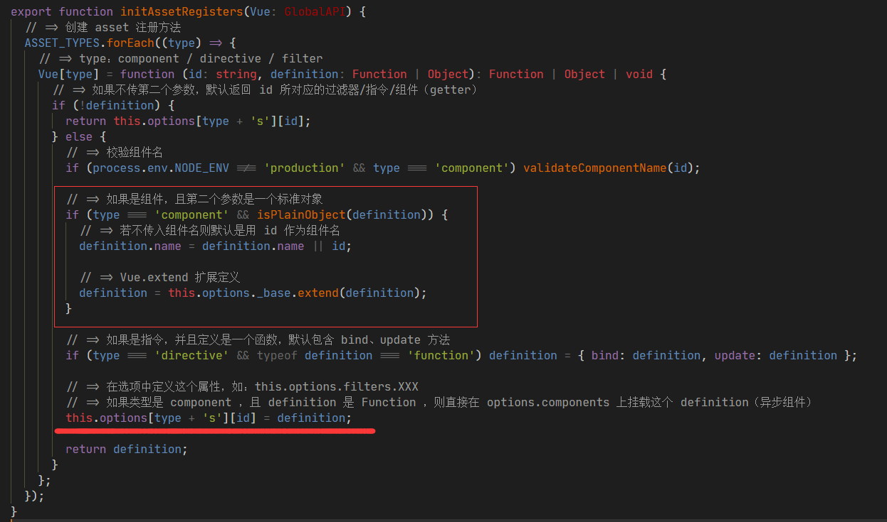
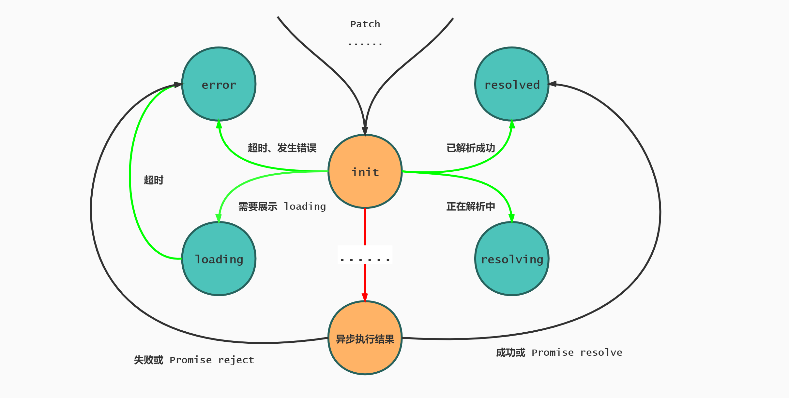

# Vue Component - Async Component

> Vue Version：v2.6.11

## 作用特点

- 异步解析
- 按需加载
- 缓存复用

## 应用场景

- 路由懒加载
- code split

## 表现形式

```js
// 普通异步形式
Vue.component('async-example', function (resolve, reject) {
  setTimeout(function () {
    resolve({ template: '<div>I am async!</div>' })
  }, 1000)
})
```

```js
//  webpack code-splitting
Vue.component('async-webpack-example', function (resolve) {
  require(['./my-async-component'], resolve)
})
```

```js
// Promise 形式
Vue.component('async-webpack-example', () => import('./my-async-component'))
```

```js
// Promise 形式
new Vue({ components: { 'my-component': () => import('./my-async-component') } })
```

```js
// 高阶可配置 Promise 形式
const AsyncComponent = () => ({
  component: import('./MyComponent.vue'),
  loading: LoadingComponent,
  error: ErrorComponent,
  delay: 200,
  timeout: 3000,
})
```

```js
// 路由懒加载
const router = new VueRouter({
  routes: [{ path: '/foo', component: () => import('./Foo.vue') }],
})
```

## SourceMap

- 工作流程图

  

  > 在解析静态资源（component）/ 执行 resolveAsset() 方法时，返回的是组件的定义，它的类型是函数。在注册静态资源时，这个函数定义是不做任何处理的（伏笔在这）。
  >
  > src\core\global-api\assets.js
  > 

  > 第一次解析异步组件时，同步代码执行完毕，返回的是 undefined，此时将创建一个空注释占位符节点用来给该异步组件占位。

- 有限状态机

  

  我将其分为以下 4 个状态：

  - error：当异步组件解析出现错误，或者设置超时期限到期后
  - loading：当需要展示 loading 组件时
  - resolved：已经解析成功
  - resolving：正在解析中

- 核心逻辑

  

  - 第一次执行 resolveAsyncComponent()，创建 sync 同步标识符，值为 true
  - 同步执行只走`绿色`的线，以及执行工厂函数 factory()
  - 若工厂函数有返回结果，则执行与 Promise 相关的逻辑
  - 由于工厂函数内部有可能有异步事件，所以同步代码执行到最后，sync 同步标识符改成了 false，最终返回的只有 undefined
  - 回到起点 Ctor === undefined，创建占位符节点占位后结束程序。
  - 当异步事件执行完毕，注册回调。
  - 等待主线程执行完毕，开始执行异步注册的回调。也就是工厂函数 factory(resolve, reject) 中的两个一次性函数参数。
  - 在 resolve(res) 回调中，参数 res 即异步组件解析结果
  - 通过 ensureCtor() 的转化，最终取得异步组件。
  - 将该异步组件挂着至 factory.resolved 属性上
  - 由于同步代码 sync 已然是 false，所以进入判断
  - 通知收集容器里的渲染 Watcher 更新
  - 逻辑再次执行到 resolveAsyncComponent() 时，由于 factory.resolved 属性已持有值，将其返回
  - 回到起点，执行组件的通用逻辑，返回虚拟 DOM 节点
  - 往后就是打 patch，将之前的占位符节点替换成该异步组件。
  - reject(reason) 同理

## SourceCode

- src\core\vdom\create-component.js

  

- src\core\vdom\helpers\resolve-async-component.js

  

  - sync 同步标识符，标识当前是同步还是异步
  - owners 实例收集容器，对同一个异步组件的引用不必多次解析，而是将当前使用该异步组件的实例收集起来，待到异步组件解析完毕，挨个通知渲染更新即可
  - once() 一次性包装函数，保证传入的函数只执行一次（避免多次执行通知更新操作）
  - res Promise 阶段性处理，若返回的是 promise，等待决议即可。
  - 对于高阶可配置形式，除了等待决议之外，对配置的参数进行状态控制（timeout / loading / error）

## 万物皆为师

- 官方

  - [Vue.js 异步组件](https://cn.vuejs.org/v2/guide/components-dynamic-async.html#%E5%BC%82%E6%AD%A5%E7%BB%84%E4%BB%B6)

  - [Vue Router 路由懒加载](https://router.vuejs.org/zh/guide/advanced/lazy-loading.html)

- 第三方

  - [Vue.js 源码全方位深入解析](https://coding.imooc.com/class/chapter/228.html#Anchor)

  - [Vue 源码浅析之异步组件注册](https://segmentfault.com/a/1190000019485927)

- 有限状态机

  - [JavaScript 与有限状态机](http://www.ruanyifeng.com/blog/2013/09/finite-state_machine_for_javascript.html)

  - [深入浅出理解有限状态机](https://zhuanlan.zhihu.com/p/46347732)

  - [web 开发中无处不在的状态机](https://zhuanlan.zhihu.com/p/26524390)

## 有限状态机与状态模式有很大区别

- 状态模式是具体的，是命令式的

- 有限状态机是抽象的，是声明式的

## End

这周的计算机网络课刚好上完了 TCP 协议，课本上的 TCP 连接管理有限状态机让我有很大感触，回想前两周学习的 Vue 源码 - 异步组件工作流程，跟这很像。于是查了查相关资料，并且记录这篇文章。

> 如同阮一峰老师所说（[JavaScript 与有限状态机](http://www.ruanyifeng.com/blog/2013/09/finite-state_machine_for_javascript.html)）：
>
> 有限状态机的写法，逻辑清晰，表达力强，有利于封装事件。一个对象的状态越多、发生的事件越多，就越适合采用有限状态机的写法。
>
> 另外，JavaScript 语言是一种异步操作特别多的语言，常用的解决方法是指定回调函数，但这样会造成代码结构混乱、难以测试和除错等问题。有限状态机提供了更好的办法：把异步操作与对象的状态改变挂钩，当异步操作结束的时候，发生相应的状态改变，由此再触发其他操作。这要比回调函数、事件监听、发布/订阅等解决方案，在逻辑上更合理，更易于降低代码的复杂度。

我对于这部分（异步组件工作流程）的理解，就把它当做了有限状态机来处理，大家都知道，异步事件最终会有不同的结果，这些结果就可以对应成不同的状态，例如：成功态、失败态、亦或是超时态。而这些不同的结果（状态），基本上都是有限的（能预知，能掌控）。所以咱们把它抽象成有限状态机，通过图文并茂的方式，更便于理解，希望本文对您有所帮助。

整个流程其实不算复杂，初看觉得很绕，但理解了工作原理之后就会觉得如此巧妙。

对于什么时候处理异步组件以及解析完成后的后续操作，我们此时并不需要关心。

有限状态机画得不是很好，也不标准，只能意思意思。若有什么疑惑或者我画得不对，有理解错误的地方，尽请提出，我会改正！

注：图片不清晰或加载失败可移步至 [GitHub](https://github.com/zhenzhenChange/zhenzhen-Blog/tree/master/Vue%20Component) 下载原图
